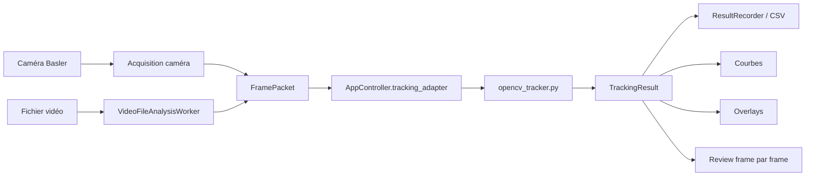
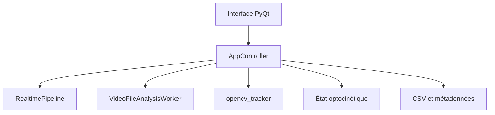
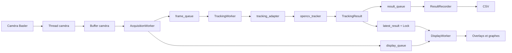
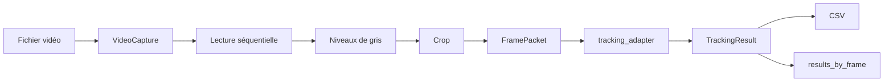

# Architecture technique de XenopusProject

> Application de suivi des mouvements oculaires et de la queue chez le têtard de *Xenopus*  
> Technologies principales : Python, PyQt5, pyqtgraph, OpenCV, pypylon/Basler et Pygame

---

## 1. Objectif de l’architecture

L’application réalise plusieurs tâches en parallèle :

- acquérir les images d’une caméra Basler ;
- analyser chaque frame avec OpenCV ;
- suivre les deux yeux et les régions R, M et C de la queue ;
- enregistrer un résultat par frame dans un fichier CSV ;
- afficher les overlays et les courbes sans bloquer l’interface ;
- enregistrer l’état de la stimulation optocinétique ;
- analyser une vidéo importée avec le même algorithme ;
- permettre une vérification frame par frame.

Ces opérations ne fonctionnent pas au même rythme. La caméra peut produire environ 200 frames par seconde, alors que l’interface n’a pas besoin d’être redessinée 200 fois par seconde. L’écriture du CSV ne doit pas non plus bloquer l’acquisition ou le tracking.

L’architecture sépare donc l’acquisition, le calcul, l’enregistrement et l’affichage.

---

## 2. Vue générale

L’application possède deux sources d’images :

1. **Real-time camera** : images provenant de la caméra Basler ;
2. **Imported video** : images lues séquentiellement depuis un fichier.

Les deux modes utilisent ensuite le même chemin de tracking.



Le mode importé ne possède pas une seconde version du tracking. Il fabrique les mêmes `FramePacket` que le mode caméra et appelle le même `tracking_adapter()`.

---

## 3. Arborescence principale

```text
XenopusProject/
│
├── MotionAnalysis_Xenopus_v2026.py
├── README.md
├── Installation.md
├── TUTORIAL.md
├── ARCHITECTURE.md
│
└── xenopus_app/
    ├── main_window.py
    ├── constants.py
    ├── acquisition/
    │   ├── camera_widget.py
    │   └── acquisition_worker.py
    ├── controller/
    │   └── app_controller.py
    ├── core/
    │   ├── app_state.py
    │   ├── frame_packet.py
    │   ├── image_container.py
    │   └── tracking_result.py
    ├── io/
    │   ├── csv_schema.py
    │   ├── result_recorder.py
    │   └── settings_manager.py
    ├── pipeline/
    │   ├── realtime_pipeline.py
    │   ├── tracking_worker.py
    │   ├── display_worker.py
    │   └── performance_monitor.py
    ├── rois/
    │   ├── define_rois.py
    │   ├── roi_items.py
    │   └── tail_arc_roi.py
    ├── stimulation/
    │   ├── optostim.py
    │   ├── okr_state.py
    │   └── ftdi_trigger.py
    ├── tracking/
    │   ├── opencv_tracker.py
    │   ├── legacy_tracking.py
    │   ├── eye_tracking.py
    │   ├── tail_tracking.py
    │   └── tracking_models.py
    ├── ui/
    │   ├── docks.py
    │   ├── imported_video_panel.py
    │   ├── overlays.py
    │   ├── plot_panel.py
    │   └── tracking_controls_panel.py
    └── video/
        ├── image_conversion.py
        ├── imported_video_worker.py
        ├── video_file_reader.py
        └── video_state.py
```

L’application utilise encore quelques éléments historiques. L’architecture est donc actuellement **hybride** : les nouveaux modules travaillent avec certaines classes provenant de l’ancienne application monolithique.

---

## 4. Point d’entrée et interface

### `MotionAnalysis_Xenopus_v2026.py`

C’est le lanceur principal. Il démarre l’application et appelle la fonction principale de `main_window.py`.

Il ne doit pas contenir l’algorithme de tracking, la gestion de la caméra ou l’écriture CSV.

### `main_window.py`

Ce module construit l’interface PyQt5 :

- les docks ;
- les graphes ;
- les contrôles caméra ;
- les ROIs ;
- les seuils ;
- le panneau optocinétique ;
- le mode vidéo importée ;
- les boutons de sauvegarde et chargement.

La fenêtre délègue les opérations complexes à `AppController`, au pipeline, au tracker et aux workers.

---

## 5. Contrôleur central

### `controller/app_controller.py`

`AppController` relie l’interface aux différents sous-systèmes.

Il coordonne :

- le démarrage et l’arrêt du mode temps réel ;
- la lecture des tailles de buffers ;
- la création du chemin CSV ;
- le lancement d’une vidéo importée ;
- l’appel de l’algorithme OpenCV ;
- la récupération des paramètres de l’interface ;
- les overlays et les graphes ;
- l’état optocinétique.



### `tracking_adapter()`

Cette méthode est le point commun entre les deux modes.

Elle reçoit un `FramePacket`, récupère les paramètres courants et appelle :

```python
result = track_frame_opencv(
    packet=packet,
    rois_eye=...,
    eye_thresholds=...,
    root_position=...,
    body_axis_y=...,
    body_angle=...,
    kernel_size=...,
    tail_arc_rois=...,
    tail_thresholds=...,
)
```

Elle renvoie ensuite un `TrackingResult`.

---

## 6. Objets échangés

### `FramePacket`

Un `FramePacket` regroupe une frame et son contexte :

```text
frame_id
timestamp
image
camera_timestamp
okr_state
metadata
```

Exemple conceptuel :

```python
packet = FramePacket(
    frame_id=152,
    timestamp=0.760,
    image=gray_image,
    camera_timestamp=123456789,
    okr_state=current_okr_state,
    metadata={"source": "camera"},
)
```

L’image seule ne permettrait pas de connaître son identifiant, son instant d’acquisition, sa source ou l’état de la stimulation.

### `TrackingResult`

Un `TrackingResult` contient les mesures calculées pour une frame :

- angles des yeux ;
- positions verticales des yeux ;
- angles et positions R, M et C ;
- état optocinétique ;
- validité ;
- erreur éventuelle ;
- descripteurs nécessaires aux overlays.

Le même `frame_id` est conservé du début à la fin :

```text
Frame caméra → FramePacket → TrackingResult → ligne CSV
```

---

## 7. Pipeline temps réel

### Chaîne complète



### `pipeline/realtime_pipeline.py`

`RealtimePipeline` crée trois files :

```python
self.frame_queue = queue.Queue(maxsize=frame_queue_size)
self.result_queue = queue.Queue(maxsize=result_queue_size)
self.display_queue = queue.Queue(maxsize=display_queue_size)
```

Il crée ensuite :

- `AcquisitionWorker` ;
- `TrackingWorker` ;
- `ResultRecorder` ;
- `PerformanceMonitor`.

Un `threading.Event` partagé permet l’arrêt :

```python
self.stop_event = threading.Event()
```

Démarrage :

```python
self.acquisition_worker.start()
self.tracking_worker.start()
self.result_recorder.start()
```

Arrêt :

```python
self.stop_event.set()
```

Le pipeline conserve également le dernier résultat dans une variable protégée par un verrou. Cette valeur est utilisée par l’affichage sans consommer la `result_queue` du CSV.

---

## 8. Threads et responsabilités

| Composant | Exécution | Responsabilité |
|---|---|---|
| Interface PyQt | Thread principal | Widgets, docks, overlays, graphes |
| Acquisition Basler | Thread caméra | Communication matérielle |
| `AcquisitionWorker` | Thread Python | Transfert des frames |
| `TrackingWorker` | Thread Python | Analyse séquentielle |
| `ResultRecorder` | Thread Python | Écriture CSV |
| `DisplayWorker` | `QTimer` Qt | Rafraîchissement visuel |
| `VideoFileAnalysisWorker` | Thread Python | Analyse d’une vidéo |
| Fenêtre Pygame | Thread dédié | Stimulation optocinétique |

Les widgets Qt ne doivent pas être modifiés directement depuis le thread de tracking. Les déplacements de ROIs, graphes, labels et overlays doivent rester dans le thread principal.

---

## 9. Principe FIFO

FIFO signifie :

```text
First In, First Out
```

Le premier élément ajouté est le premier récupéré.

```text
Entrée : 100 → 101 → 102 → 103
Sortie : 100 → 101 → 102 → 103
```

`queue.Queue` applique ce principe :

```python
frame_queue.put(packet)
packet = frame_queue.get()
```

Le FIFO est nécessaire pour :

- préserver l’ordre temporel ;
- conserver des `frame_id` continus ;
- synchroniser les yeux, la queue et l’OKR ;
- détecter les frames manquantes ;
- produire un CSV cohérent.

Une stratégie qui récupère uniquement la dernière frame disponible paraît plus réactive, mais ignore les frames intermédiaires.

---

## 10. Les buffers

### Buffer caméra

Il reçoit les images directement depuis la caméra. Il absorbe de très petites variations entre l’arrivée d’une frame et sa récupération par le logiciel.

### Tracking buffer — `frame_queue`

Il contient les `FramePacket` en attente d’analyse.

```text
AcquisitionWorker → frame_queue → TrackingWorker
```

Un buffer de 500 signifie que jusqu’à 500 frames peuvent attendre.

Il absorbe un ralentissement temporaire, mais ne rend pas le tracking plus rapide.

### Result buffer — `result_queue`

Il contient les `TrackingResult` en attente d’écriture.

```text
TrackingWorker → result_queue → ResultRecorder
```

Il évite que l’écriture disque bloque directement le calcul.

### Display buffer — `display_queue`

Il sert uniquement au rendu visuel.

L’interface ne doit pas essayer d’afficher 200 frames par seconde. Le `DisplayWorker` vide donc cette queue et conserve le paquet visuel le plus récent.

Les anciennes frames d’affichage peuvent être ignorées sans supprimer automatiquement les résultats de tracking ou les lignes CSV, car les trois queues sont distinctes.

---

## 11. Latence et débit

À 200 FPS, une nouvelle frame arrive toutes les :

```text
1 / 200 s = 5 ms
```

Le tracking doit donc prendre en moyenne moins de 5 ms par frame pour ne pas accumuler de retard.

La latence approximative est :

```text
latence ≈ frames en attente / FPS caméra
```

À 200 FPS :

| Frames en attente | Latence |
|---:|---:|
| 10 | 0,05 s |
| 50 | 0,25 s |
| 100 | 0,50 s |
| 500 | 2,50 s |

Un grand buffer absorbe une pointe de charge, mais pas un déficit permanent.

Exemple :

```text
Caméra   : 200 FPS
Tracking : 190 FPS
Déficit  : 10 frames/s
```

Un buffer de 500 frames sera rempli en environ 50 secondes.

---

## 12. Comportement actuel en cas de queue pleine

`AcquisitionWorker` utilise actuellement une logique de type :

```python
try:
    q.put_nowait(item)
except queue.Full:
    q.get_nowait()
    q.put_nowait(item)
```

Lorsque la queue est pleine, l’élément le plus ancien est retiré et le plus récent est ajouté.

Cette politique est adaptée au `display_queue`, qui privilégie l’état visuel le plus récent.

Appliquée à la `frame_queue`, elle signifie cependant qu’une frame peut être supprimée si le tracking buffer est saturé.

Le comportement réel est donc :

> FIFO tant que la `frame_queue` n’est pas pleine ; remplacement de la plus ancienne frame en cas de saturation.

Pour un fonctionnement strictement sans perte, il faudrait distinguer les politiques :

```text
frame_queue   : FIFO strict ou blocage contrôlé
result_queue  : FIFO strict
display_queue : latest-only
```

Un blocage du producteur avec `queue.put()` introduit toutefois une pression en retour, ou **backpressure**. Il faut alors vérifier que le buffer caméra peut lui-même conserver les images pendant l’attente.

---

## 13. Acquisition

### `acquisition/camera_widget.py`

Ce module gère :

- la connexion Basler ;
- le démarrage et l’arrêt ;
- la résolution ;
- les offsets ;
- le FPS ;
- l’exposition ;
- les buffers ;
- le trigger ;
- l’affichage du FPS obtenu.

### `acquisition/acquisition_worker.py`

Il lit les frames depuis :

```python
ui.video_capture_widget.acquisition_thread.get_frame_for_analysis()
```

Il crée ensuite un `FramePacket`, ajoute l’état OKR et envoie le paquet dans les queues.

Il ne doit pas faire le tracking, écrire le CSV ou modifier l’interface.

---

## 14. Tracking

### `pipeline/tracking_worker.py`

Le worker consomme les paquets séquentiellement :

```python
packet = frame_queue.get()
result = tracking_function(packet)
result_queue.put(result)
```

Il ne modifie pas directement Qt.

### `tracking/opencv_tracker.py`

Ce module effectue uniquement le traitement d’image. Il ne gère ni la caméra, ni les fichiers, ni les docks.

Cette séparation permet :

- d’utiliser le même code en live et en import ;
- de tester le tracker indépendamment ;
- de profiler et optimiser le calcul ;
- de remplacer l’algorithme sans réécrire l’interface.

---

## 15. Tracking des yeux

Pour chaque œil :

1. conversion de la ROI en coordonnées entières ;
2. limitation de la ROI aux dimensions de l’image ;
3. conversion PyQtGraph vers OpenCV ;
4. extraction du crop ;
5. `GaussianBlur` ;
6. seuillage ;
7. ouverture morphologique ;
8. recherche du contour principal ;
9. enveloppe convexe ;
10. `cv2.fitEllipse()` ;
11. calcul de l’angle corrigé par rapport à l’axe du corps.

Le descripteur de l’ellipse est conservé dans les métadonnées du résultat pour l’overlay.

---

## 16. Tracking de la queue R, M et C

La queue est divisée en trois secteurs optionnels :

- **R** : rostral ;
- **M** : médian ;
- **C** : caudal.

Chaque secteur possède :

- une géométrie ;
- un seuil ;
- une courbure ;
- un état activé/désactivé ;
- un point détecté ;
- un angle ;
- une position X/Y.

### `rois/tail_arc_roi.py`

`TailArcROI` représente un secteur annulaire défini par :

```text
center
inner_radius
outer_radius
start_angle
end_angle
```

L’utilisateur peut déplacer l’arc, modifier sa largeur, ses extrémités et sa courbure.

Le slider de courbure recalcule le rayon et les angles tout en conservant au mieux la position centrale de l’arc.

### Cache des masques

Le tracker utilise des caches de masques et de pixels :

```python
_TAIL_ARC_MASK_CACHE
_TAIL_ARC_PIXEL_CACHE
```

Si l’arc n’a pas changé, le masque est réutilisé. S’il est déplacé ou redimensionné, sa version interne change et le masque est recalculé.

---

## 17. Enregistrement CSV

### `io/result_recorder.py`

`ResultRecorder` est un thread indépendant.

```text
TrackingWorker → result_queue → ResultRecorder → CSV
```

Une ligne correspond à un `TrackingResult`.

Le CSV contient :

- les métadonnées ;
- le `frame_id` ;
- les timestamps ;
- les mesures des yeux ;
- les mesures R, M et C ;
- l’état optocinétique ;
- la validité ;
- les erreurs.

Le fichier est vidé périodiquement avec un `flush`, par exemple toutes les 50 lignes.

Lors de l’arrêt, le recorder continue jusqu’à ce que la demande d’arrêt soit reçue **et** que la `result_queue` soit vide.

### `io/csv_schema.py`

Ce module centralise l’ordre et le nom des colonnes. Lorsqu’une nouvelle mesure est ajoutée, il faut mettre à jour le modèle de résultat, le tracker, le schéma et le recorder.

---

## 18. Affichage

### `pipeline/display_worker.py`

`DisplayWorker` utilise un `QTimer`.

Configuration typique :

```text
Display FPS : 25
Plot FPS    : 10
```

Il met à jour :

- les ellipses ;
- les axes ;
- les points R, M et C ;
- les graphes.

Dans l’architecture hybride actuelle, l’image live elle-même reste affichée par le widget caméra historique.

### Séparation données / affichage

Les données sont stockées immédiatement après le tracking, pas lors du rafraîchissement visuel.

```text
Tracking à 200 FPS
Affichage à 25 FPS
CSV à une ligne par résultat
```

La fréquence d’affichage peut donc être inférieure sans réduire le nombre de résultats scientifiques.

---

## 19. Mode Imported video

### `video/imported_video_worker.py`

Le worker :

1. ouvre la vidéo avec `cv2.VideoCapture` ;
2. lit les métadonnées ;
3. lit chaque frame dans l’ordre ;
4. convertit en niveaux de gris ;
5. applique le crop ;
6. crée un `FramePacket` ;
7. appelle le même `tracking_adapter()` ;
8. envoie le résultat au recorder ;
9. conserve le résultat dans `results_by_frame` ;
10. met à jour la progression.



Lorsque le FPS est connu :

```python
timestamp = frame_id / fps
```

Le mode importé n’est pas contraint par la vitesse réelle de la vidéo. Si le traitement est plus lent, l’analyse dure simplement plus longtemps sans devoir supprimer des frames.

### Review frame par frame

`results_by_frame[frame_id]` permet de récupérer le résultat exact d’une frame et de réafficher ses overlays.

---

## 20. Stimulation optocinétique

### `stimulation/optostim.py`

Ce module gère :

- le panneau PyQt ;
- les motifs ;
- la fenêtre Pygame ;
- la vitesse ;
- la direction ;
- les modes continu et alterné ;
- la pause ;
- la durée en cycles ;
- l’écran choisi.

### État par frame

`AppController.get_state()` crée un snapshot :

```text
active
paused
width
spacing
speed
frequency
duration_cycle
duration_enabled
pattern
mode
direction
direction_text
```

Cet état est attaché à la frame puis écrit dans le CSV.

### `okr_state.py`

Ce module protège l’état partagé afin qu’un thread lise un ensemble cohérent de paramètres.

### `ftdi_trigger.py`

Il gère le signal matériel FTDI séparément du tracking.

---

## 21. Sauvegarde JSON

### `io/settings_manager.py`

Le même fichier JSON peut restaurer les deux modes.

Il contient notamment :

```text
analysis_mode
video_state
imported_video
imported_crop
tail_reference_points
tail_arcs
eye_rois
thresholds
camera_settings
output_settings
```

Pour R, M et C, il enregistre :

```text
enabled
threshold
curve
initialized
geometry
```

La géométrie comprend le centre, les rayons, les angles et la version de l’arc.

Le champ de version du format permet de faire évoluer les réglages sans ambiguïté.

---

## 22. Modules UI

### `ui/docks.py`

Gère la disposition et la visibilité des docks selon le mode actif.

### `ui/imported_video_panel.py`

Gère l’ouverture, le crop, l’analyse, la progression et la review.

### `ui/overlays.py`

Affiche les résultats déjà calculés. Il ne doit pas refaire le tracking.

### `ui/plot_panel.py`

Affiche les courbes des yeux et de la queue.

### `ui/tracking_controls_panel.py`

Gère les boutons de tracking, la validation, les resets et la sortie CSV.

---

## 23. Monitoring

### `pipeline/performance_monitor.py`

Le moniteur mesure :

- le nombre de frames traitées ;
- les FPS ;
- les temps de traitement ;
- les écarts de `frame_id` ;
- la taille des queues ;
- leur maximum.

Détection d’un saut :

```python
gap = current_frame_id - last_frame_id

if gap > 1:
    missing_frames += gap - 1
```

Exemple :

```text
100, 101, 102, 105
```

Les frames 103 et 104 sont considérées manquantes.

### Interprétation

- `frame_queue` augmente : le tracking prend du retard ;
- `result_queue` augmente : l’écriture ne suit pas ;
- `display_queue` augmente : l’interface ne consomme pas assez vite ;
- `frame_queue` atteint sa limite : risque de remplacement d’une frame.

---

## 24. Cycle de vie du temps réel

### Démarrage

1. validation des paramètres ;
2. choix du CSV ;
3. lecture des tailles de buffers ;
4. création du pipeline ;
5. création du `DisplayWorker` ;
6. verrouillage des contrôles de buffers ;
7. démarrage des workers ;
8. démarrage du timer d’affichage.

### Arrêt

1. arrêt du `DisplayWorker` ;
2. activation de `stop_event` ;
3. arrêt des workers ;
4. vidage final de la `result_queue` ;
5. fermeture du CSV ;
6. réactivation des contrôles ;
7. affichage des statistiques.

---

## 25. Principes à préserver

### Une seule implémentation du tracking

Le live et l’import doivent utiliser le même `tracking_adapter()`.

### Tracker indépendant de Qt

Le tracker ne doit pas appeler de widgets ou de boîtes de dialogue.

### Stockage indépendant de l’affichage

Les résultats doivent être stockés au rythme réel du tracking.

### Conservation du `frame_id`

Le même identifiant doit traverser toute la chaîne.

### Buffers définis avant le démarrage

Une `queue.Queue` déjà créée ne doit pas être redimensionnée pendant l’acquisition.

### Interface dans le thread principal

Les modifications graphiques doivent passer par Qt.

### Arrêt propre

Utiliser `stop_event`, vider les résultats, joindre les threads et fermer le fichier.

---

## 26. Ajouter une nouvelle mesure

Exemple : vitesse de la queue.

1. ajouter le champ dans `TrackingResult` ;
2. calculer la valeur dans `opencv_tracker.py` ;
3. l’ajouter dans `csv_schema.py` ;
4. l’écrire dans `result_recorder.py` ;
5. ajouter éventuellement une liste et un graphe ;
6. l’afficher en review ;
7. tester le live et l’import ;
8. vérifier la continuité des `frame_id`.

---

## 27. Tests recommandés

### Continuité

```python
diff = frame_id[i + 1] - frame_id[i]
```

Valeur attendue :

```text
1
```

### Cohérence

```text
frames traitées
=
TrackingResult produits
=
lignes CSV
```

### Saturation

Tester plusieurs FPS et relever :

- FPS réel ;
- FPS de tracking ;
- taille maximale de `frame_queue` ;
- frames manquantes ;
- temps moyen par frame.

### Reproductibilité

Comparer une acquisition live avec la réanalyse de la même vidéo et des mêmes réglages.

### Sauvegarde

Vérifier que `Save settings` puis `Load settings` restaure toutes les ROIs, les arcs, les seuils, le crop et les paramètres de sortie.

---

## 28. Limites actuelles

### Architecture hybride

Le live caméra conserve encore une partie de l’ancien système d’affichage.

### Couplage à l’interface

`tracking_adapter()` lit encore directement certains widgets. Une évolution possible serait un objet immuable `TrackingConfig`.

### Queue pleine

La logique actuelle peut retirer la plus ancienne frame de `frame_queue` lorsqu’elle est saturée.

### Threads Python

Le GIL limite certaines parties Python. Des optimisations futures peuvent utiliser du multiprocessing, Numba, Cython, C++ ou du calcul GPU.

### Mémoire du mode importé

`results_by_frame` conserve tous les résultats. Une très longue vidéo peut utiliser beaucoup de mémoire.

---

## 29. Résumé

### Temps réel

```text
Caméra
→ buffer caméra
→ AcquisitionWorker
→ FramePacket
→ frame_queue
→ TrackingWorker
→ tracking_adapter
→ opencv_tracker
→ TrackingResult
→ result_queue
→ ResultRecorder
→ CSV
```

En parallèle :

```text
TrackingResult
→ latest_result
→ DisplayWorker
→ overlays et graphes
```

### Vidéo importée

```text
Fichier vidéo
→ lecture séquentielle
→ niveaux de gris
→ crop
→ FramePacket
→ même tracking_adapter
→ même opencv_tracker
→ TrackingResult
→ CSV
→ results_by_frame
→ review frame par frame
```

---

## 30. Glossaire

**Backpressure** : mécanisme par lequel un consommateur lent force le producteur à attendre.

**Buffer** : zone mémoire temporaire contenant des données en attente.

**FIFO** : premier entré, premier sorti.

**FramePacket** : objet regroupant l’image, son identifiant, ses timestamps et ses métadonnées.

**Goulot d’étranglement** : composant le plus lent qui limite le débit global.

**Latest-only** : politique qui conserve seulement l’élément le plus récent.

**Lock** : verrou protégeant une donnée partagée entre plusieurs threads.

**Overlay** : élément graphique superposé à l’image.

**Pipeline** : chaîne organisée d’étapes de traitement.

**Queue** : file d’attente thread-safe.

**ROI** : zone de l’image dans laquelle le traitement est effectué.

**TrackingResult** : objet contenant les mesures calculées pour une frame.

**Worker** : composant exécutant une tâche spécialisée.

---

## 31. Conclusion

L’architecture repose sur trois principes :

1. séparer acquisition, tracking, affichage et enregistrement ;
2. utiliser le même tracking pour le live et les vidéos importées ;
3. conserver un `frame_id` et des métadonnées explicites pour chaque frame.

Les queues permettent aux tâches de fonctionner à des rythmes différents. Le FIFO préserve l’ordre temporel, tandis que l’affichage utilise volontairement une logique orientée vers le résultat le plus récent.

Le principal point de vigilance reste la saturation du tracking buffer : dans le code actuel, une queue pleine peut remplacer la plus ancienne frame. Pour une garantie stricte de zéro perte, la politique du `frame_queue` doit être séparée de celle du `display_queue`, puis validée par des tests de charge et une vérification systématique des `frame_id`.
