# Tutoriel d’utilisation de XenopusProject

Ce tutoriel explique l’utilisation complète de l’application dans ces deux onglets :

1. **Real-time camera** : acquisition et tracking en temps réel avec une caméra Basler.
2. **Imported video** : analyse d’une vidéo déjà enregistrée, avec contrôle frame par frame.

Les captures d’écran indiquées dans ce document doivent être placées dans le dossier :

```text
docs/images/tutorial/
```

---

# Avant de commencer

Lancer l’application depuis le dossier du projet via Spyder :

```text
.venv\Scripts\python.exe MotionAnalysis_Xenopus_v2026.py
```

Au démarrage, l’application ouvre par défaut le mode **Real-time camera**.

La barre supérieure permet de basculer entre les deux onglets:

- **Real-time camera**
- **Imported video**

> Attention ! Ne pas lancer simultanément une acquisition caméra et une analyse de vidéo importée.

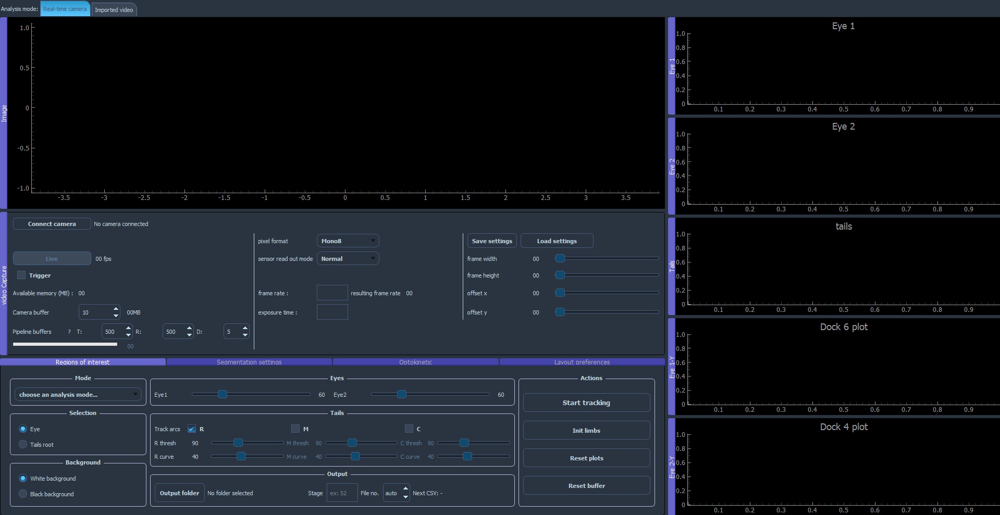

---

# Partie 1 — Utilisation en temps réel

## 1. Sélectionner le mode Real-time camera

Dans la barre supérieure, cliquer sur :

```text
Real-time camera
```

Dans ce mode, l’application affiche notamment :

- l’image de la caméra ;
- le panneau `video Capture` ;
- les réglages des ROIs ;
- les seuils de segmentation ;
- les graphes des yeux et de la queue ;
- le panneau optocinétique ;
- les boutons de sauvegarde et de chargement des réglages.


---

## 2. Connecter la caméra

Dans le panneau `video Capture`, cliquer sur :

```text
Connect camera
```

Lorsque la caméra est détectée :

- son nom remplace `No camera connected` ;
- le bouton `Live` devient disponible ;
- les paramètres de la caméra peuvent être modifiés.

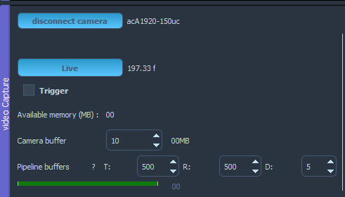

### En cas d’échec

Vérifier que :

- la caméra est alimentée ;
- le câble réseau ou USB est correctement branché (3.0 conseillé) ;
- la caméra est visible dans Basler pylon Viewer ;
- aucun autre logiciel n’utilise déjà la caméra ;
- Basler pylon et le pilote de la caméra sont installés.

---

## 3. Configurer la caméra

Les principaux paramètres du panneau caméra sont :

- **Frame width** : largeur de l’image acquise ;
- **Frame height** : hauteur de l’image acquise ;
- **Offset X / Offset Y** : position de la zone d’acquisition dans le capteur ;
- **Frame rate** : fréquence d’acquisition demandée ;
- **Resulting frame rate** : fréquence réellement obtenue ;
- **Exposure time** : temps d’exposition ;
- **Camera buffer** : nombre maximal de frames conservées côté acquisition ;
- **Pipeline buffers** :
  - `T` : frames en attente de tracking ;
  - `R` : résultats en attente d’écriture dans le CSV ;
  - `D` : éléments conservés pour l’affichage ;
- **Trigger** : active le signal FTDI lors du démarrage du tracking.

Configurer ces paramètres avant de lancer le tracking. Les tailles de buffers du pipeline sont lues au démarrage de l’analyse.

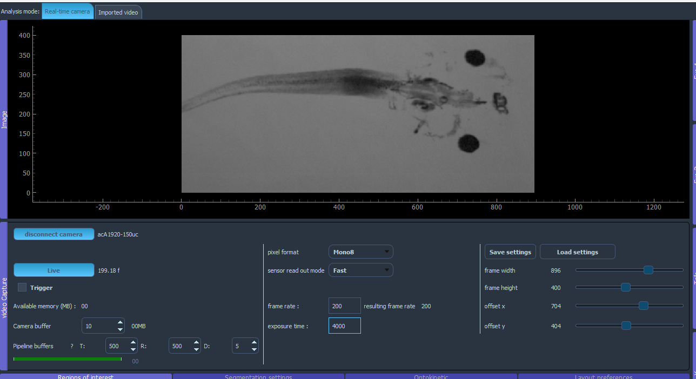

> Une fréquence élevée, une grande résolution et un temps de traitement important augmentent la charge du processeur et la mémoire nécessaire. Risque de perte de frames si le pipeline est saturé. Ajuster les paramètres pour obtenir un flux fluide.

---

## 4. Afficher le flux vidéo

Cliquer sur :

```text
Live
```

Le flux de la caméra apparaît dans le panneau `Image`.

Le nombre affiché à côté de `Live` correspond à la fréquence mesurée.

Avant de placer les ROIs, vérifier que :

- le Xénope est correctement centré ;
- les yeux sont nets ;
- la queue est visible ;
- l’exposition n’est ni trop sombre ni saturée ;
- l’image ne contient pas de mouvement parasite important.

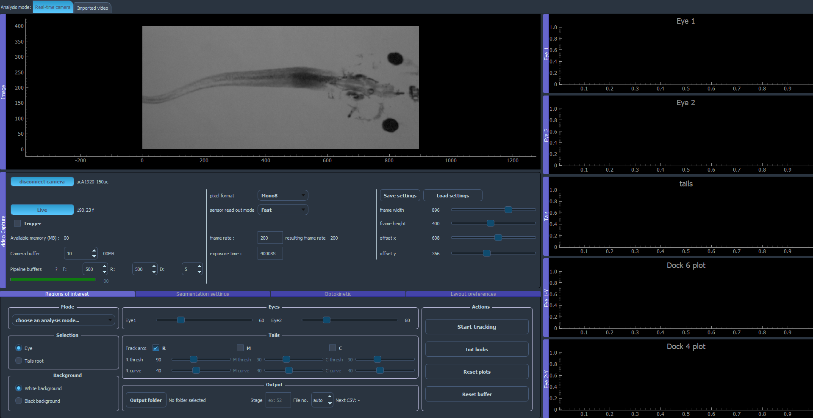

---

## 5. Choisir le type d’analyse

Dans le panneau `Regions of interest`, sélectionner un mode :

- **eyes-tails track** : tracking des yeux et de la queue ;
- **eyes track only** : tracking des yeux uniquement.

Le tracking ne peut pas démarrer tant qu’un mode d’analyse n’a pas été sélectionné.

---

## 6. Placer les ROIs des yeux

1. Sélectionner le bouton radio :

```text
Eye
```

2. Cliquer au centre du premier œil.
3. Cliquer au centre du deuxième œil.
4. Redimensionner et déplacer les rectangles bleus pour entourer correctement chaque œil.

L’application accepte au maximum deux ROIs d’œil.

Les ROIs sont nommées :

- `Eye1`
- `Eye2`

Les rectangles doivent :

- contenir l’œil entier ;
- éviter autant que possible les contours voisins ;
- rester suffisamment petits pour limiter le temps de calcul ;
- laisser une petite marge pour les mouvements de l’œil.

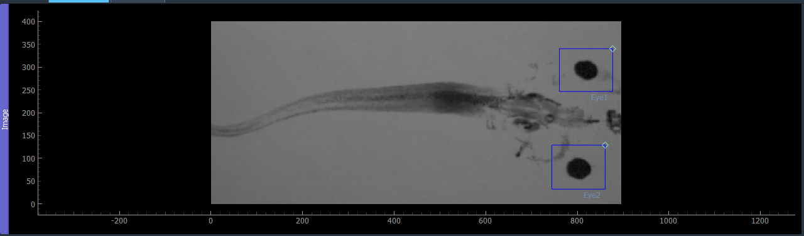

### Supprimer une ROI

Utiliser l’action de suppression de la ROI concernée (clique droit sur la ROI), puis recréer la ROI si nécessaire.

---

## 7. Placer les références du corps et de la queue

Sélectionner :

```text
Tails root
```

Puis cliquer approximativement au niveau de la jonction du tronc cérébral mollepinière du têtard.

L’application crée les marqueurs suivants :

- `root` : point de référence à placer au niveau de la jonction du tronc cérébral mollepinière ;
- `nose` : point à placer au niveau des narines, généralement entre les deux ;
- `R`, `M` et `C` : trois points optionnels correspondant aux différentes parties de la queue.

Déplacer ensuite les marqueurs pour les positionner précisément :

- placer `root` au niveau de la jonction du tronc cérébral mollepinière ;
- placer `nose` entre les deux narines ;
- placer `R` sur la partie rostrale de la queue, proche du corps ;
- placer `M` sur la partie médiane de la queue ;
- placer `C` sur la partie caudale, vers l’extrémité de la queue.

Les points `R`, `M` et `C` sont optionnels. Ils peuvent être activés ou désactivés indépendamment à l’aide des cases situées dans la partie inférieure de l’interface.

Cocher uniquement les parties de la queue qui doivent être analysées, puis positionner chaque point sur la zone correspondante de la queue du têtard.

L’axe `root → nose` sert de référence pour calculer les angles corrigés.

---

## 8. Régler les arcs R, M et C

Le tracking de la queue utilise trois zones en arc :

- **R** : partie rostrale, proche de la racine ;
- **M** : partie médiane ;
- **C** : partie caudale.

Les couleurs sont :

- R : rouge ;
- M : vert ;
- C : bleu.

Chaque arc peut être activé ou désactivé avec sa case à cocher.

Pour chaque arc :

1. activer sa case ;
2. déplacer ses poignées pour couvrir la partie correspondante de la queue ;
3. ajuster sa largeur et sa courbure ;
4. vérifier que l’arc couvre la queue sans inclure trop de fond ;
5. régler le seuil associé.

Les valeurs `R curve`, `M curve` et `C curve` modifient la courbure de chaque zone.

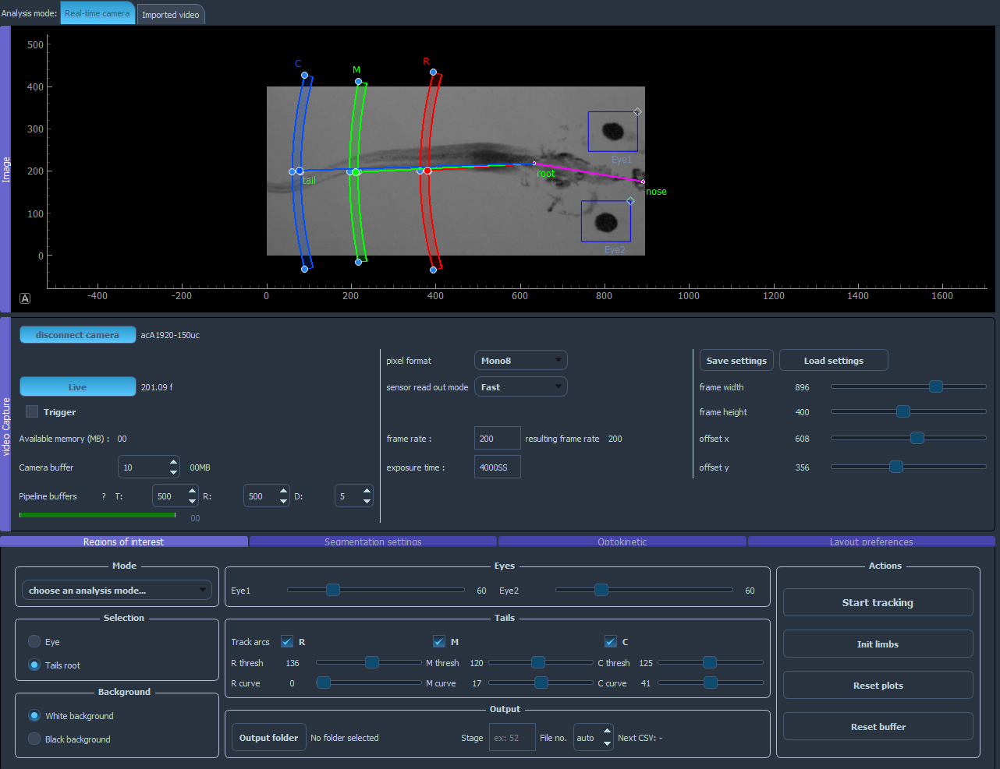

> Un arc désactivé est masqué et n’est pas envoyé au tracking.

---

## 9. Régler les seuils de segmentation

Le panneau de segmentation contient les seuils :

- `Eye1`
- `Eye2`
- `R thresh`
- `M thresh`
- `C thresh`

Ajuster chaque valeur jusqu’à ce que l’élément recherché soit correctement détecté.

Pour les yeux :

- l’ellipse doit suivre la forme de l’œil ;
- l’axe de l’œil doit rester stable ;
- éviter les seuils qui sélectionnent une grande partie du fond.

Pour la queue :

- chaque arc doit détecter la queue dans sa propre zone ;
- le point de tracking doit rester sur la queue ;
- éviter les reflets, bulles et bords du récipient.

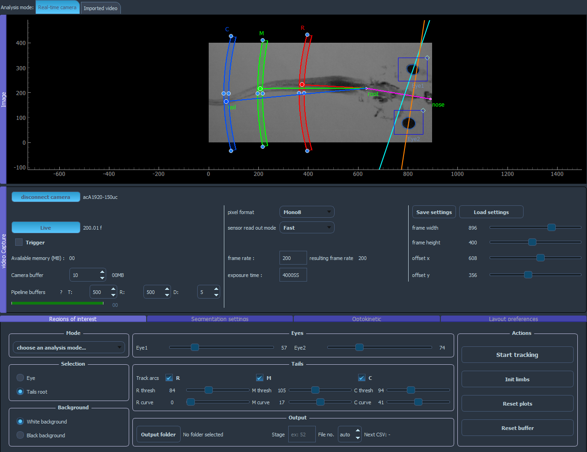

---

## 10. Configurer le dossier de sortie

Avant de démarrer le tracking :

1. cliquer sur `Output folder` ;
2. sélectionner le dossier de destination ;
3. renseigner le stade du têtard dans `Stage` ;
4. laisser `File no.` sur `auto` ou saisir manuellement un numéro précis ;
5. vérifier le nom du fichier affiché après `Next CSV`.

Exemple :

```text
Stage : 52
File no. : auto
```

Lorsque `File no.` est réglé sur `auto`, l’application recherche automatiquement le prochain numéro disponible dans le dossier de destination.

Par exemple, si les fichiers suivants existent déjà :

```text
Stage52_000.csv
Stage52_001.csv
Stage52_002.csv
```

l’application proposera automatiquement :

```text
Stage52_003.csv
```

Il est également possible de saisir manuellement un numéro dans `File no.`.

Dans ce cas :

- si aucun fichier CSV ne possède déjà ce numéro, l’application crée directement le nouveau fichier avec le numéro choisi ;
- si un fichier CSV avec ce numéro existe déjà, une fenêtre de confirmation s’ouvre afin de demander si le fichier doit être remplacé ;
- le fichier existant n’est remplacé que si l’utilisateur confirme l’opération dans cette fenêtre.

Avant de démarrer, vérifier attentivement la valeur affichée après `Next CSV`, car elle correspond au fichier qui sera créé ou remplacé.

L’application refuse de démarrer le tracking si le dossier de sortie ou le stade n’est pas renseigné.

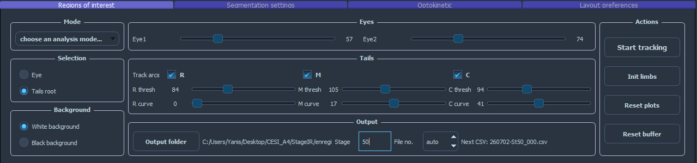

---

## 11. Sauvegarder ou charger les réglages

### Save settings

Le bouton `Save settings` enregistre notamment :

- le mode d’analyse ;
- les ROIs des yeux ;
- les marqueurs root, nose et tail ;
- les arcs R, M et C ;
- les seuils ;
- les courbures ;
- les arcs activés ;
- les paramètres du panneau caméra ;
- le dossier de sortie ;
- le stade ;
- le numéro de fichier.

Le fichier est enregistré au format JSON.

### Load settings

Le bouton `Load settings` recharge un fichier JSON précédemment enregistré.

Après le chargement :

- vérifier les positions des ROIs ;
- vérifier les dimensions de l’image ;
- vérifier les seuils ;
- vérifier le dossier de sortie et le nom du prochain CSV.

---

## 12. Configurer la stimulation optocinétique

Le panneau `Optokinetic` permet de régler le stimulus visuel.

### Motifs disponibles

- `White Lines`
- `Green Lines`
- `Grid`
- `Diagonal Grid`
- `Random dots`

### Valeurs par défaut

Pour `White Lines` et `Green Lines` :

```text
Width: 50
Spacing: 50
Speed: 1
Switch frequency: 5
Cycle/Duration: 12
```

Pour `Random dots` :

```text
Width: 20
Spacing: 20
Speed: 1
Switch frequency: 5
Cycle/Duration: 12
```

### Modes de déplacement

- `Continue` : déplacement continu dans une direction ;
- `Alternate` : changement périodique de direction.

### Direction

- `Right`
- `Left`

### Durée

Cocher la case à côté de `Duration` pour arrêter automatiquement la stimulation après le nombre de cycles indiqué.

### Choix de l’écran

1. cocher `Open on selected screen` ;
2. sélectionner le moniteur ;
3. utiliser le bouton `↻` si la liste des écrans doit être actualisée.

### Commandes

- `screen/stop` : ouvrir ou fermer la fenêtre de stimulation ;
- `Pause` : arrêter temporairement le mouvement ;
- `Start` : reprendre le mouvement.

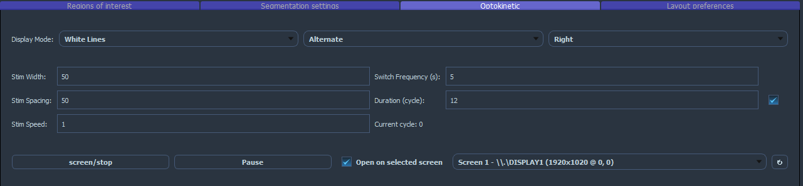

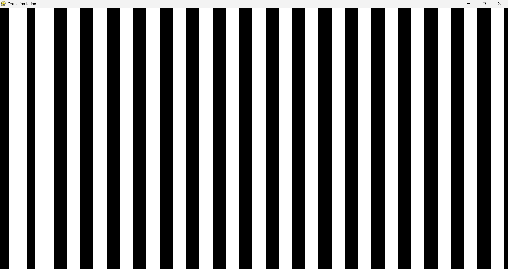

---

## 13. Démarrer le tracking en temps réel

Avant de démarrer, vérifier :

- caméra connectée ;
- mode `Real-time camera` actif ;
- type d’analyse sélectionné ;
- ROIs correctement placées ;
- marqueurs et arcs correctement placés ;
- seuils validés ;
- dossier de sortie choisi ;
- stade renseigné ;
- nom du prochain CSV correct.

Cliquer ensuite sur :

```text
Start tracking
```

Au démarrage, l’application :

1. vide les anciens graphes et buffers ;
2. initialise le pipeline ;
3. démarre l’écriture du CSV ;
4. démarre l’acquisition ;
5. analyse chaque frame ;
6. affiche les résultats et les overlays.

Pendant le tracking :

- ne pas modifier les buffers ;
- éviter de déplacer les ROIs ;
- vérifier que les points et ellipses restent sur les structures suivies ;
- surveiller le remplissage du buffer ;
- vérifier que les graphes évoluent normalement.

---

## 14. Arrêter le tracking

Cliquer sur :

```text
Stop
```

L’application arrête :

- l’acquisition ;
- le tracking ;
- l’écriture du CSV ;
- les workers du pipeline.

Les graphes complets sont alors affichés.

Vérifier dans le dossier de sortie que le CSV a été créé.

---

# Partie 2 — Analyse d’une vidéo importée

## 1. Sélectionner le mode Imported video

Dans la barre supérieure, cliquer sur :

```text
Imported video
```

Dans ce mode :

- le panneau caméra n’est pas utilisé ;
- une barre dédiée apparaît sous l’image ;
- les mêmes ROIs, arcs, seuils et algorithmes de tracking sont réutilisés ;
- les résultats sont également écrits dans un CSV.

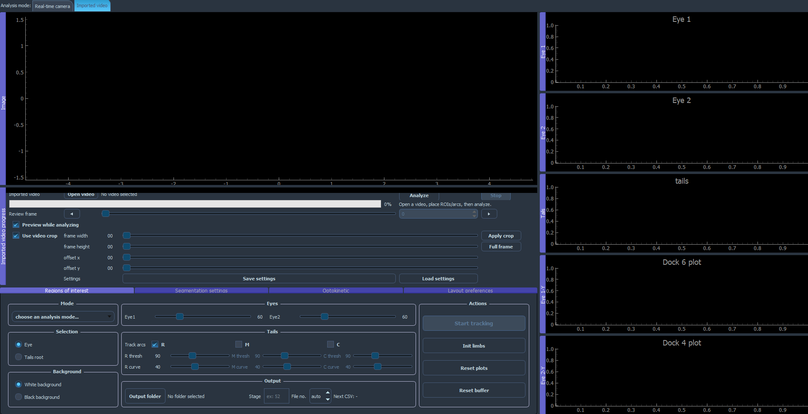

---

## 2. Ouvrir une vidéo

Cliquer sur :

```text
Open video
```

Formats acceptés :

```text
AVI, MP4, MOV, MKV, MPG, MPEG
```

Après sélection, l’application affiche :

- la première frame ;
- le chemin du fichier ;
- le nombre de frames ;
- la fréquence de la vidéo ;
- la taille originale ;
- la taille affichée après crop.

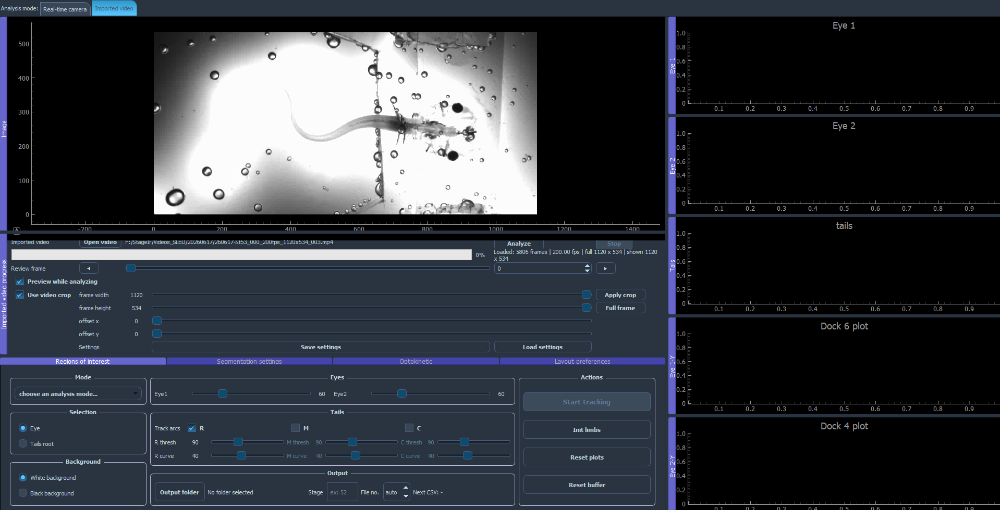

---

## 3. Recadrer la vidéo

Le crop permet de limiter l’analyse à une partie de l’image.

Les contrôles sont :

- `frame width`
- `frame height`
- `offset x`
- `offset y`
- `Apply`
- `Reset`

Procédure :

1. cocher l’activation du crop ;
2. régler la largeur et la hauteur ;
3. régler les offsets X et Y ;
4. cliquer sur `Apply` ;
5. vérifier l’image obtenue.

Le bouton `Reset` restaure la frame complète.

> Placer les ROIs après avoir appliqué le crop. Les coordonnées des ROIs correspondent à l’image recadrée.

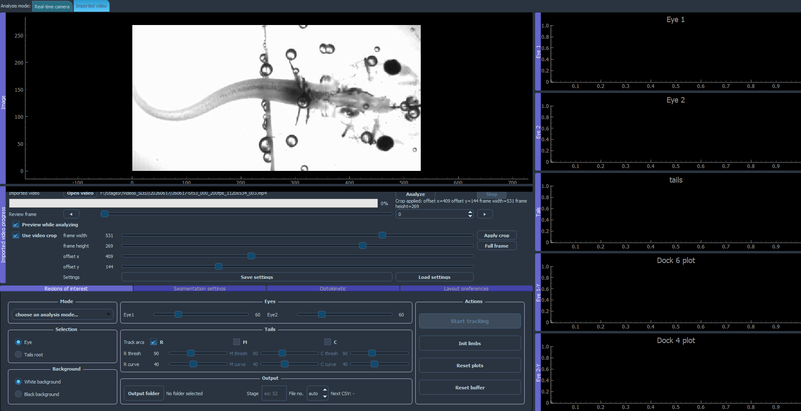

---

## 4. Placer les ROIs sur la vidéo

Le placement est identique au mode temps réel.

### Yeux

1. sélectionner `Eye` ;
2. cliquer sur chaque œil ;
3. ajuster les rectangles.

### Queue

1. sélectionner `Tails root` ;
2. placer les marqueurs `root`, `nose` et `tail` ;
3. positionner les arcs R, M et C ;
4. activer les arcs nécessaires ;
5. régler les courbures et les seuils.

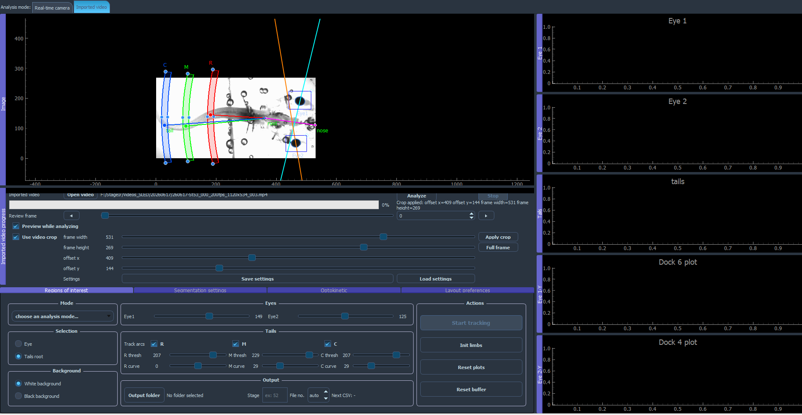

---

## 5. Préparer le fichier de sortie

Comme en mode temps réel :

1. sélectionner `Output folder` ;
2. renseigner `Stage` ;
3. choisir `File no.` ou laisser `auto` ;
4. vérifier `Next CSV`.

Les réglages peuvent être enregistrés avec `Save settings` puis rechargés avec `Load settings`.

Le fichier JSON peut enregistrer :

- le chemin de la vidéo ;
- le crop ;
- les ROIs ;
- les arcs ;
- les seuils ;
- le dossier de sortie ;
- le stade et le numéro du fichier.

---

## 6. Lancer l’analyse

Cocher ou décocher :

```text
Preview while analyzing
```

Lorsque cette option est active, l’application affiche périodiquement la frame en cours avec les résultats du tracking. L’aperçu n’est pas actualisé à chaque frame afin d’éviter de ralentir l’analyse.

Cliquer sur :

```text
Analyze
```

Pendant l’analyse, la barre affiche :

- le pourcentage de progression ;
- la frame actuelle ;
- le nombre total de frames ;
- le nombre de lignes écrites dans le CSV.

Le bouton `Stop` permet d’interrompre l’analyse.

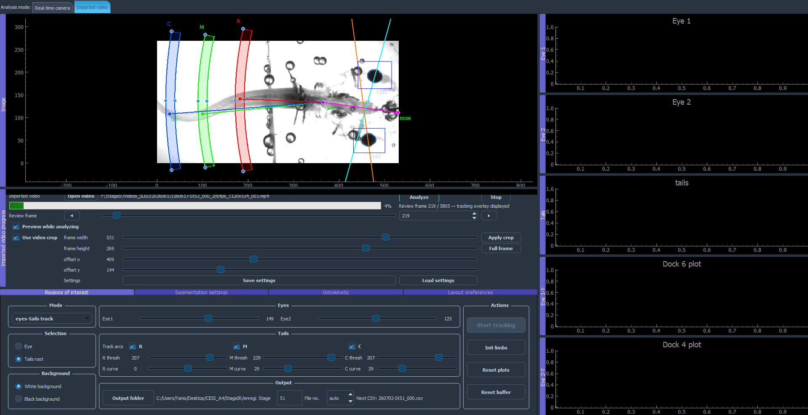

---

## 7. Fin de l’analyse

Lorsque l’analyse est terminée :

- la progression atteint 100 % ;
- le statut indique le nombre de frames analysées ;
- le nombre de lignes écrites dans le CSV est affiché ;
- les graphes complets sont mis à jour ;
- la dernière frame analysée est affichée avec les overlays.

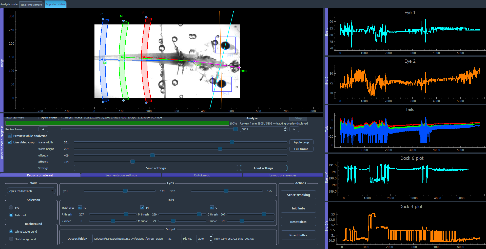

---

## 8. Vérifier le tracking frame par frame

La zone `Review frame` permet de parcourir la vidéo analysée.

Utiliser :

- `◀` : frame précédente ;
- `▶` : frame suivante ;
- le slider : déplacement rapide ;
- le champ numérique : accès direct à une frame.

Lorsqu’un résultat existe pour la frame sélectionnée, l’application affiche :

- les ellipses des yeux ;
- les axes des yeux ;
- les points de queue R, M et C ;
- les lignes associées aux points détectés.

Cette fonction permet d’identifier précisément :

- une mauvaise détection ponctuelle ;
- une perte de l’œil ;
- un point de queue placé sur le fond ;
- un seuil inadapté ;
- une ROI ou un arc mal positionné.

<video
    src="docs/images/tutorial/21_review_frame.mp4"
    autoplay
    loop
    muted
    playsinline
    controls
    width="100%">
</video>

---

# 9. Vérification des résultats

Après une analyse, vérifier :

- que le CSV existe ;
- que le nombre de lignes correspond au nombre de frames analysées ;
- que les `frame_id` sont continus ;
- que les timestamps sont cohérents ;
- que les colonnes des yeux contiennent les valeurs attendues ;
- que les colonnes R, M et C sont remplies pour les arcs activés ;
- que les paramètres optocinétiques correspondent à la stimulation utilisée ;
- qu’aucune erreur importante n’est signalée dans les colonnes de validité ou d’erreur.

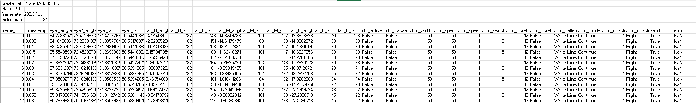

---

# 10. Problèmes fréquents

## La caméra n’apparaît pas

- fermer pylon Viewer ;
- rebrancher la caméra ;
- vérifier l’adresse IP ;
- vérifier le pilote Basler ;
- relancer l’application.

## Le bouton de tracking refuse de démarrer

Vérifier :

- le mode d’analyse ;
- le dossier de sortie ;
- le stade ;
- les ROIs nécessaires ;
- la vidéo ou la caméra active.

## L’œil n’est pas détecté

- repositionner la ROI ;
- modifier le seuil ;
- réduire la ROI ;
- améliorer l’éclairage ou la mise au point.

## Le tracking de la queue détecte le fond

- réduire ou déplacer l’arc ;
- modifier le seuil de l’arc concerné ;
- vérifier la courbure ;
- désactiver un arc inutile.

## Le mode import affiche une mauvaise zone

- réinitialiser le crop ;
- appliquer à nouveau le crop ;
- replacer les ROIs après le crop.

## Le fichier CSV existe déjà

L’application demande confirmation avant de l’écraser. Modifier `File no.` ou laisser le mode automatique choisir le prochain numéro disponible.

---

# 11. Checklist rapide

## Temps réel

- [ ] Caméra connectée
- [ ] Paramètres caméra réglés
- [ ] Mode d’analyse choisi
- [ ] Deux ROIs d’œil placées si nécessaire
- [ ] Marqueurs root, nose et tail placés
- [ ] Arcs R, M et C réglés
- [ ] Seuils vérifiés
- [ ] Dossier de sortie choisi
- [ ] Stade renseigné
- [ ] Nom du CSV vérifié
- [ ] Optocinétique configurée
- [ ] Tracking démarré
- [ ] CSV vérifié après arrêt

## Vidéo importée

- [ ] Mode Imported video sélectionné
- [ ] Vidéo ouverte
- [ ] Crop appliqué
- [ ] ROIs placées après le crop
- [ ] Arcs et seuils réglés
- [ ] Dossier de sortie choisi
- [ ] Stade renseigné
- [ ] Preview activée ou désactivée
- [ ] Analyse lancée
- [ ] Review frame par frame effectuée
- [ ] CSV vérifié

---
